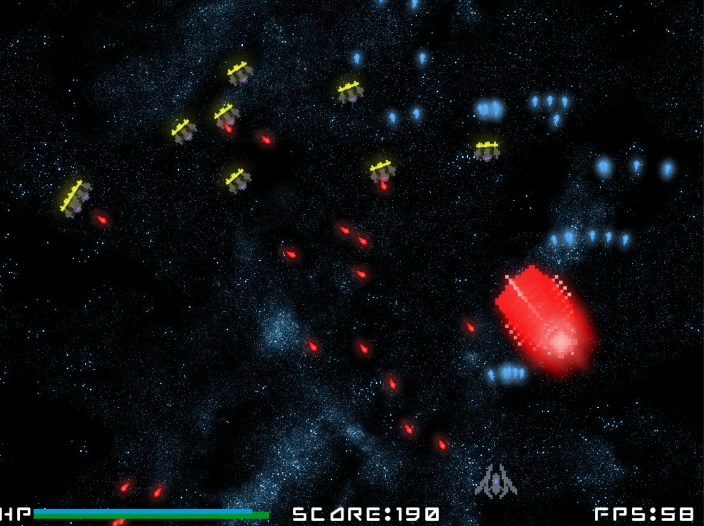
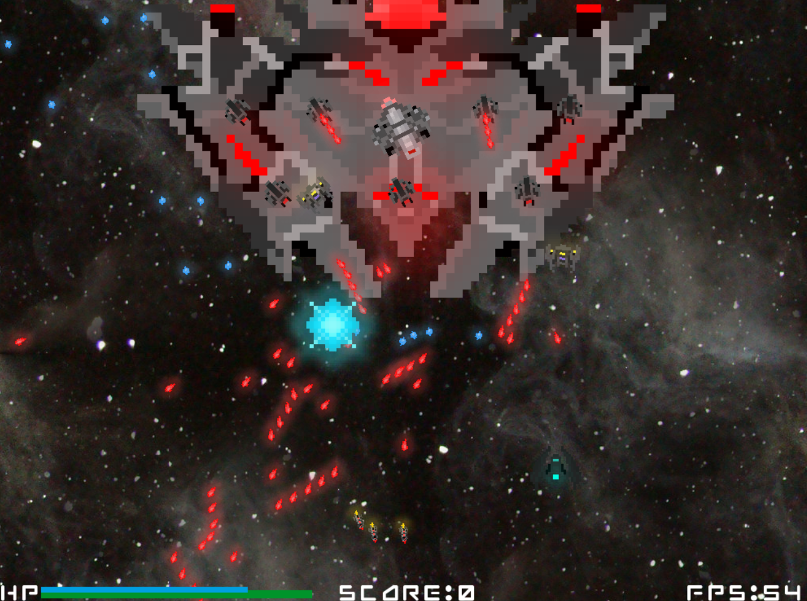

**WORK IN PROGRESS**

_NOTE: Meant to be run on Python 3.7 or any compatible version with Pygame_

**DOWNLOAD A DEMO [HERE.](https://drive.google.com/file/d/1IG5TXE3D65jzQhSIlu_q3-AKYB8aY6KX/view?usp=sharing)**
Currently the demo is only compatible with Windows operating systems. Unpack the .zip and run the .exe.

**SOURCE CODE:** [https://github.com/rkwong43/Tears-Under-Heaven](https://github.com/rkwong43/Tears-Under-Heaven)

_Screenshot from the game's Survival Mode: Classic._

Personal project using self-taught Python and the Pygame library. Is currently under development.
  * Features decoupled views, models, controllers, and logic for behavior of enemies.
  * Has a collision detection algorithm for detecting when projectiles and ships intersect.
  * Supports different frame rates (default=60) while keeping the same gameplay.
  * Controller and main allow for restarting the game upon end.
  * Menu is implemented in the form of a tree structure.
  * Unique algorithms for different enemy types and projectiles such as homing missiles.
  * Pixel art and effects created by myself, Roger Kwong.
  * In-game music created by [Scott Buckley](https://www.scottbuckley.com.au/) and used under the Creative Commons Attribution International 4.0 license. Current tracks used are [Undertow](https://www.scottbuckley.com.au/library/undertow/) and [Endurance](https://www.scottbuckley.com.au/library/?s=endurance).
  * Backgrounds and sound effects are temporary until custom ones are created.
 
 [Link](https://www.pygame.org/news) to Pygame homepage.
 
 As of now, all weapons and ships are permanently unlocked for the player for demo purposes.
## Current Game Features:
Describes the current gameplay features inside the game.
  * Difficulty Settings:
    * Difficulty affects the rate at which enemies spawn, their statistics such as health, shielding, and movement speed, their fire rate, and the amount of experience required to level up.
  * Survival
    * Classic:
      * Survive against hordes of enemy ships.
      * Every type of enemy in the game is featured inside Classic.
      * Leveling up will increase the player's health, shield, shield regeneration, fire rate, and weapon damage. Level thresholds are dependent on score and is doubled every level.
      * Every weapon is available for use.
      * Types of enemies spawned are chosen randomly based on an assigned combat rating and the total combat rating allowed for the current wave.
      * Every wave, the total combat rating is reset and increased by a certain amount.
    * Mandible Madness:
      
      * Survive against hordes of hornet-like Mandible ships.
      * Leveling is the same as in Classic, except the initial level threshold is lower.
      * Every weapon is available for use.
      * Every few waves (depending on difficulty), the health, shield, damage, score, and quantity of Mandibles will increase. The wave that their stats increase will have one Mandible given a railgun and boosted health and shield.
    * Heaven:
      * Survive against hordes of difficult enemy ships.
      * Every larger enemy ship is featured in Heaven Survival.
      * Leveling is the same as in Classic.
      * Every weapon is available for use.
      * Enemy spawning is the same as in Classic.
  * Challenge
    
    * Titan Slayer:
      * Duel against a large Titan enemy ship with the base weapons.
      * All weapons are available for use.
      * Score is not relevant, game victory returns the time taken to destroy the Titan.
      * Difficulty affects the health and fire rate of the Titan and its turrets.
  * Tutorial
    * Leads the player through basic controls (WASD to move, SPACE to shoot).
    * Gives the player a sample enemy to destroy.
    * Introduces the concept of health, shield, and how each increase or regenerate.
    * Informs the player that ESC can be used to pause, and if paused, BACKSPACE will exit the game to the title screen.
  * Hangar
    * Consists of ships, weapons, and enemies to view.
    * Each page displays the selected entity and limited stats on its base form.
    * Uses a smaller model to simulate firing of shown weapons of the player and the selected enemy.

## Future Features
Features currently under development or planned for the future.
 * Expanding on enemy artificial intelligence.
 * Streamlined creation for enemies and players.
 * Adding or creating a custom ship for the player.
 * Adding sound and scrolling animations for the menu.
 * Adding a story mode with chapters.
 * Adding a constant progression system (for release of game)
 * Locking weapons until unlocked (for final release of game)
 * Writing high scores and statistics to a file.
 * Adding settings for modifying resolution, frame rate, and sound/music volume.
 * More game modes, enemies, and weapons!

## How to Add Ships
    * Create sprites for the animated, base, damaged, and shielded images.
    * Create an EntityID for them, name the images EntityID_animation.png, 
    EntityID_base.png EntityID_damaged.png, and EntityID_shield.png respectively.
    * Place the images into the images folder under resources.
    * Add the Entity ID to the ship list in init_images() in the View.
    * Create a class for the new ship, extending the Ship class, or Enemy class if the
    new ship is an enemy.
    * Add the ship's stats to the get_ship_stats(EntityID) function inside the 
    ship_stats.py file.
    * Alter the MenuView, MenuModel, to add the ship to the hangar if needed.
    * If player, alter the constructor inside the Model. If enemy, alter the spawn_enemy(EntityID)
    in whatever game mode enemy AI class the ship is to be added to.
    